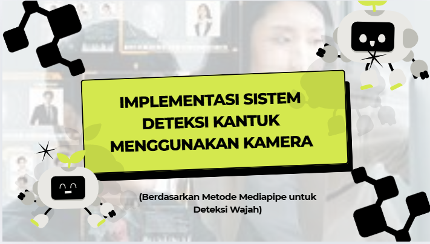
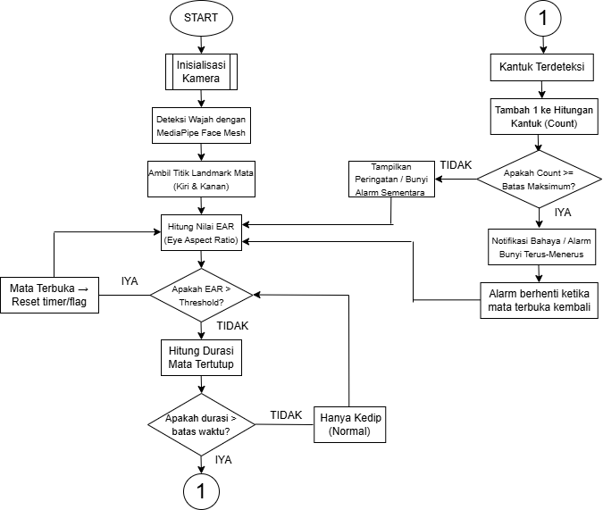

  

# KATA PENGANTAR
Proyek ini dibuat sebagai bentuk implementasi teknologi Computer Vision untuk mendeteksi tingkat kantuk seseorang secara real-time menggunakan kamera. Sistem ini dikembangkan dengan bantuan MediaPipe Face Mesh untuk melacak pergerakan area mata dan menghitung Eye Aspect Ratio (EAR) sebagai indikator utama apakah mata terbuka atau tertutup.

Melalui metode ini, sistem mampu mengenali kondisi kantuk berdasarkan durasi mata tertutup dan memberikan peringatan berupa suara serta notifikasi agar pengguna tetap waspada. Proyek ini diharapkan dapat membantu meningkatkan keselamatan kerja maupun berkendara, terutama bagi pengguna yang membutuhkan fokus tinggi dalam jangka waktu lama.

Pengembangan dilakukan menggunakan Python dengan dukungan pustaka seperti mediapipe, opencv, tkinter, dan pygame, serta dilengkapi antarmuka sederhana agar mudah digunakan oleh pengguna umum maupun pengembang.

Kami berharap proyek ini dapat menjadi kontribusi kecil dalam bidang keamanan berbasis visi komputer, sekaligus membuka peluang penelitian lanjutan untuk sistem deteksi kelelahan yang lebih cerdas dan akurat.

# DI SUSUN OLEH
| No    | Nama                      | NIM        |
| ----- | ------------------------- | ---------- |
| **1** | Arfin Nurur Robbi         | 2122600002 |
| **2** | Nataratungga Xina Tannisa | 2122600006 |
| **3** | Ahmad Zen Ashari          | 2122600009 |
| **4** | Thofail Syakirudin        | 2122600037 |
| **5** | Muhammad Iqbal Hanafi     | 2122600043 |

# TUJUAN
| No    | Tujuan                                                                                                           |
| ----- | ---------------------------------------------------------------------------------------------------------------- |
| **1** | Mendeteksi tanda-tanda kantuk secara real-time menggunakan kamera.                                               |
| **2** | Memberikan peringatan (visual + suara + notifikasi) saat mata tertutup melebihi ambang waktu.                    |
| **3** | Menyimpan jumlah kejadian kantuk untuk analisis dan evaluasi.                                                    |
| **4** | Menyediakan antarmuka (GUI) untuk konfigurasi ambang waktu, nada peringatan, dan resolusi kamera bagi developer. |

# METODE YANG DIGUNAKAN
MediaPipe Face Mesh adalah model deteksi wajah berbasis machine learning yang mampu memetakan 468 titik (landmark) pada wajah manusia secara 3D dan real-time.
Model ini menggunakan Deep Neural Network (DNN) untuk mengenali fitur wajah seperti mata, hidung, dan mulut dari citra kamera.

Dalam proyek Deteksi Kantuk, sistem memanfaatkan titik-titik di sekitar mata untuk menghitung Eye Aspect Ratio (EAR) — yaitu rasio antara tinggi dan lebar mata.
Jika mata mulai menutup, nilai EAR akan menurun — kondisi ini diidentifikasi sebagai tanda kantuk atau kelelahan.

# MENGAPA VIOLA–JONES (HAARCASCADE) TIDAK DIGUNAKAN
Metode Viola–Jones (Haarcascade) memang populer untuk deteksi wajah dasar, tetapi kurang sesuai untuk deteksi kantuk berbasis gerakan mata, karena:

**1.** Hanya mendeteksi area mata secara bounding box, bukan titik (landmark).

**2.** Tidak sensitif terhadap perubahan kecil, seperti kelopak mata yang menutup sebagian.

**3.** Rentan terhadap pencahayaan, posisi, dan sudut wajah.

**4.** Tidak bisa mendeteksi kondisi mata tertutup atau terbuka secara akurat.

# ALGORITMA SISTEM

  

# KONSEP SISTEM
Konsep sistem kali ini yaitu ada:
**1** Deteksi Mata dan Wajah
  -
